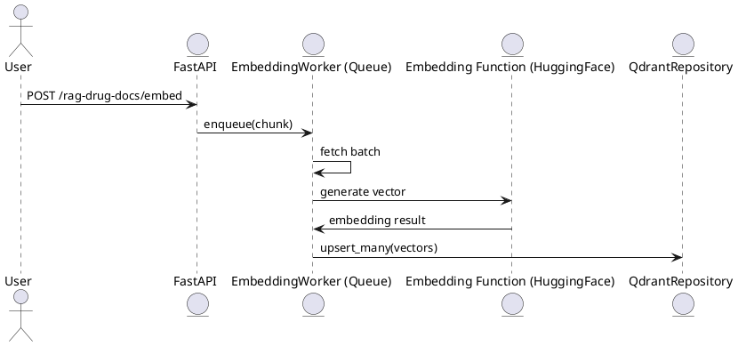

# 🧠 Custom RAG Embedding Server - 프로젝트 설명 및 아키텍처

이 포스팅에서는 직접 구현한 FastAPI 기반 RAG Embedding Server의 구조, 동작 방식, 설계 의도 등을 설명합니다.  
해당 서버는 Qdrant를 벡터 스토어로 사용하며, 테스트 데이터를 기반으로 한 임베딩을 비동기 방식으로 처리합니다.

<!-- truncate -->

---

## ✅ 프로젝트 개요 및 목적

- **왜 직접 구현했나?**
    - 단일 목적 (긴 내용의 데이터 chunk 임베딩)에 최적화된 가벼운 서버 필요
    - HuggingFace 기반 임베딩 모델 사용 제어
    - 동시성 제어, 큐 기반 워커 처리, 요청 속도 제한 등 세밀한 제어 요구
    - 일반적인 오픈소스 솔루션보다 종속성 최소화 및 배포 용이성 확보

---

## 📦 주요 컴포넌트

### ✅ 1. `api.py`: FastAPI 엔드포인트

- `/rag-drug-docs/embed`: POST API
- 입력 스키마: `TestRagChunkListRequest`
- 내부 큐에 입력을 push → `EmbeddingWorker`가 async 처리

```python
@app.post("/rag-drug-docs/embed")
async def embed_documents(request: TestRagChunkListRequest):
    for chunk in request.chunks:
        await embedding_worker.enqueue(chunk)
    return {"status": "enqueued", "count": len(request.chunks)}
```

---

### 🔁 2. `embedding_worker.py`: 임베딩 큐 & 워커

- `asyncio.Queue` 기반의 내부 큐
- 백그라운드에서 `start()`로 워커가 실행됨
- 일정 단위로 큐에서 요청을 꺼내 벡터 생성 및 저장 처리

```python
class EmbeddingWorker:
    async def start(self):
        while True:
            batch = await self._next_batch()
            vectors = self.embedding_fn(batch)
            self.embedding_repository.upsert_many(vectors)
```

- **속도 제한** (`embedding_max_rate`) 및 **동시성** (`max_parallel_tasks`) 지원
- 재시도 및 에러 로깅도 포함

---

### 🧠 3. `embedding_repository.py`: Qdrant 연동

- `upsert_many(vectors: List[EmbeddingRecord])`
    - 임베딩된 벡터 리스트를 Qdrant에 저장
- Qdrant의 컬렉션명, payload schema는 `payload_builder.py`를 통해 유연하게 확장 가능

---

## 🧩 전체 처리 흐름




---

## 🧾 정리

| 구성요소 | 역할 | 비고 |
|----------|------|------|
| FastAPI | REST API | POST 요청 수신 |
| EmbeddingWorker | 비동기 큐 및 처리 워커 | asyncio 기반 |
| HuggingFaceEmbedding | 텍스트 임베딩 | 모델 커스터마이징 가능 |
| QdrantRepository | 벡터 저장소 | payload 확장 가능 |

---

## 🧪 로컬 테스트 방법

`scripts/` 폴더에는 rag-embedding-server를 Docker 환경에서 빠르게 빌드하고 실행할 수 있는 테스트 스크립트들이 포함되어 있습니다.

### 🐳 1. Docker 이미지 빌드

```bash
./scripts/build-rag-embedding-server.sh
```

> `Dockerfile`이 있는 프로젝트 루트에서 실행하세요.

### ▶️ 2. Docker 컨테이너 실행

```bash
./scripts/start-rag-embedding-server.sh
```

기본 포트는 `localhost:8000`입니다.

### 🩺 3. Health Check (상태 확인)

```bash
curl http://localhost:8000/rag-drug-docs/status
```

정상이라면 다음과 같은 JSON 응답을 받습니다:

```json
{
  "current_task_queue_size": 0,
  "max_queue_size": 2000,
  "queue_available": true
}
```

> 이 상태를 기반으로 클라이언트 요청을 **throttling**할 수 있습니다 (아래 예시 참고).

### 📤 4. 테스트 임베딩 요청

```bash
curl -X POST http://localhost:8000/rag-drug-docs/embed \
  -H "Content-Type: application/json" \
  -d @sample_chunks.json
```

> `sample_chunks.json`에는 `TestRagChunk` 형식의 문서 배열이 있어야 합니다.

### 🧪 Python 샘플 코드 (비동기 상태 확인 및 대기)

```python
import asyncio
import aiohttp

async def is_queue_available(status_url: str) -> bool:
    async with aiohttp.ClientSession() as session:
        try:
            async with session.get(status_url) as response:
                response.raise_for_status()
                data = await response.json()
                return data["queue_available"]
        except Exception as e:
            print(f"Status check failed: {e}")
            return False

async def wait_until_available(status_url: str, max_retries: int = 30, wait_secs: float = 1.0):
    for attempt in range(max_retries):
        if await is_queue_available(status_url):
            print("✅ Queue available.")
            return
        print(f"⏳ Queue full, waiting {wait_secs}s... (attempt {attempt + 1}/{max_retries})")
        await asyncio.sleep(wait_secs)
    raise TimeoutError("Queue did not become available.")
```

---

## 🔧 RAG Embedding Server 확장을 위한 고려사항

### ✅ 현재 구조 (단일 인스턴스)

- FastAPI 기반의 서버 하나에서 직접 embedding 작업 수행
- 메모리 큐 + 백그라운드 워커 패턴 (async queue)
- 병렬 처리량 한계는 단일 프로세스 성능에 의존

---

### 🧱 1단계 확장: NGINX 기반 Round-Robin 부하 분산

#### 📌 아키텍처
```
Client ──> NGINX ──> [ Instance A ]
                 └─> [ Instance B ]
                 └─> [ Instance C ]
```

#### ✅ 구성 방식
- 여러 개의 `rag-embedding-server` 인스턴스 실행 (각기 다른 포트)
- NGINX가 각 인스턴스로 **Round-Robin 방식**으로 요청 분산

#### ✅ 장점
- 간단한 구성
- 메모리 기반 queue를 인스턴스마다 독립적으로 유지 가능
- Python 코드 수정 없이 확장 가능

#### ⚠️ 단점
- queue 상태를 NGINX가 모름 → 특정 인스턴스가 과부하일 수 있음
- embedding 결과의 순서를 보장하지 않음
- 상태 기반 smart routing은 어려움

---

### ⚙️ 2단계 확장: Celery + Redis 기반 분산 처리

#### 📌 아키텍처
```
Client ──> FastAPI API Server ──> Redis Queue ──> Celery Workers (N개)
```

#### ✅ 구성 방식
- API 서버는 `embedding 요청`을 Celery Task로 Redis에 enqueue
- 여러 Celery Worker가 Redis Queue에서 task를 병렬로 소비
- embedding 결과는 DB 혹은 callback 방식으로 반환

#### ✅ 장점
- 완전한 분산 처리 구조
- queue 상태, 재시도 정책, 작업 모니터링 등 관리 용이
- scale-out (Worker 수 조절로 유연한 확장 가능)
- RAG 재인덱싱, 장기 처리에도 적합

#### ⚠️ 단점
- Redis + Celery 구성 필요 (운영 복잡도 증가)
- 작업 흐름을 관리하는 별도 레이어 추가 필요 (결과 저장, ack 등)

---

### 🔁 비교 요약

| 항목            | NGINX 방식                   | Celery + Redis 방식               |
|-----------------|------------------------------|-----------------------------------|
| **확장성**       | 수동 인스턴스 추가             | 동적 확장 (Worker 수로 조절)       |
| **큐 공유**      | 인스턴스별 독립               | 중앙 Redis 기반 공유              |
| **실패 처리**     | 제한적                        | 자동 재시도, 모니터링              |
| **구현 복잡도**   | 낮음                          | 중간~높음                          |
| **권장 상황**     | 트래픽이 일정하고 구성이 단순할 때 | 고성능/고신뢰 embedding 파이프라인 필요할 때 |
